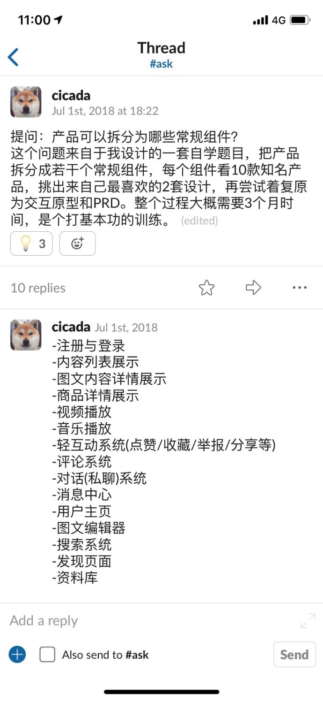

# Chapter-1

本章节主要用于对axure组件进行分析，提升对各功能模块认知。
9102年了，我还在学习组件
想法来源于_纯银_大佬的一条微博23333

每天下午13:00-15:00间学习总结-限workday

### 传送门

[1. 登录注册](Signup&Signin.md)

### 食用方法
 * 00 使用5W1H[1](#补充)的方法了解概念
 * 01 了解应用场景，在什么情况下使用，优缺点等
 * 02 试用实际产品，分析到底要如何使用，使用示例
 * 03 应用场景，用户，策略，方法整体分析与总结，给出各版本综合
 * 04 原型设计
 * 05 PRD

#### 补充
 - [1.5W1H](www.google.com)

changelog
--
- 20190417: AliceY 创建
