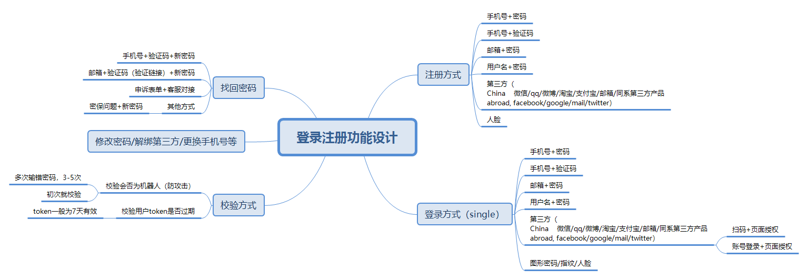

# Sign up&Sign in 登录注册

#### 00. 什么是登录注册？[\[1\]](#参考资料)
> 注册：创建账号或初次加入某些域名/站点/APP
> 登录：为了能操作已创建的账号下的某些功能、获取账号下缓存的信息等，向已注册过的网页/app等应用商提供名称和密码的操作

对登录注册的功能进行拆分，包含了以下功能点[\[2\]](#参考资料)

#### 01. 这些功能分别代表什么，在何种情况下使用？[\[3\]](#参考资料)
##### 注册
通常我们创建账号时分配一个ID给用户，叫做UserId，验证UserId的唯一，就保证了账号唯一，这样即使用户有修改用户名的需求，仍然可以保证用户的唯一性；
UserId可以对应：_用户名、手机号、邮箱等数据，_ 这就组成了我们熟知的注册形式.

* **用户名+密码**
  * 字段：UserId + password
  * 环境：常用于web端、pc端
  * 案例：淘宝
  * 使用方法：给自己起个名字，此用户名必须是唯一的，不能重复，比如等。    
  * 优点：
  * 缺点：注册一时爽，登录火葬场，这个名称通常在注册时是唯一的，但也代表着不容易记忆，随着使用频次的降低，这个名称很容易被淡忘，也就是通常所说的不符合用户记忆规律，那什么好记呢？

* **手机号+密码**
 * 字段：phoneNum + password
 * 环境：常用于app端（也开始迁移到web、pc端）
 * 案例：饿了吗、美团、抖音（初期）、支付宝
 * 使用方法：给自己起个名字，此用户名必须是唯一的，不能重复，比如等。    
 * 优点：随着移动网络的普及每个人都有了手机号码，姑且我们认为具有唯一性，因为每个人只对应，也方便用户记忆
 * 缺点：

* **邮箱+密码**
  * 字段：userMail + password
  * 环境：常用于web端、国外、社区/论坛等推出的app
  * 案例：
  * 使用方法：    
  * 优点：
  * 缺点：

  #### 03. 应用是否需要登录（强制/开放）？是否需要注册（强制/开放）？为什么？
  环境：PC端、Web端、移动端，针对这三端，举例说明。

#### 参考资料
 - [1.what is sign up and sign in](https://www.quora.com/What-is-the-difference-between-sign-up-and-sign-in)
 - [2.登录注册全解：“登录注册”这潭水到底有多深？](http://www.woshipm.com/pd/750964.html)
 - [3.关于网站用户注册动机与目的](http://www.shejidaren.com/%E5%85%B3%E4%BA%8E%E7%BD%91%E7%AB%99%E7%94%A8%E6%88%B7%E6%B3%A8%E5%86%8C%E5%8A%A8%E6%9C%BA%E4%B8%8E%E7%9B%AE%E7%9A%84.html)
changelog
--
- 20190417: AliceY 创建
